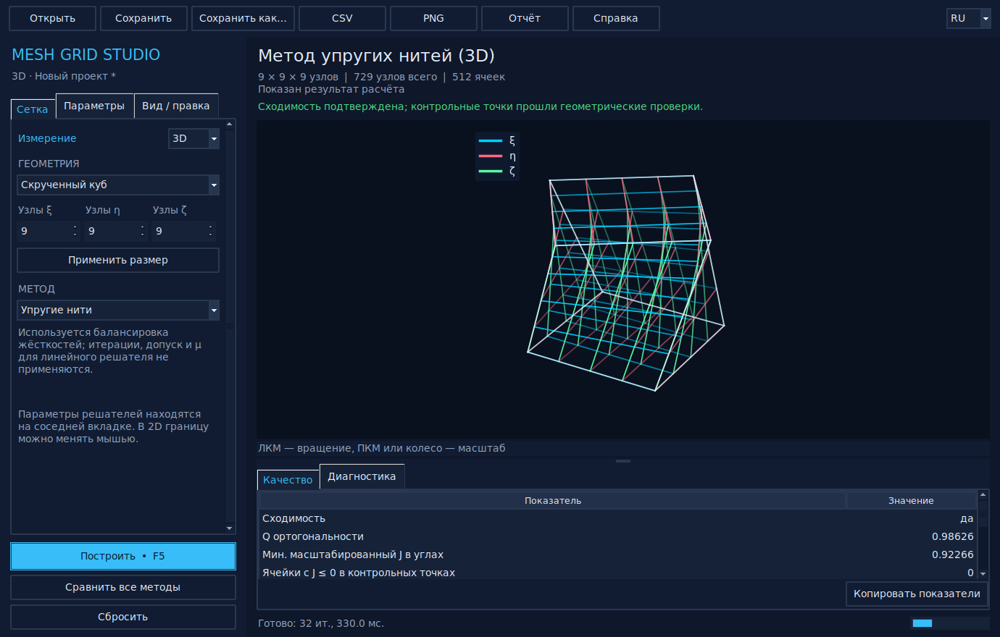
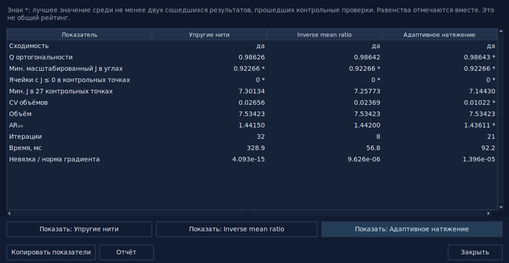
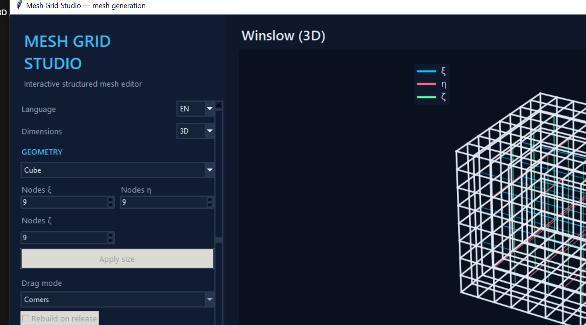

# Mesh Grid Studio

Интерактивная программа и воспроизводимое исследование вариационных алгоритмов
построения двумерных и трёхмерных структурированных расчётных сеток:

- метода упругих нитей;
- метода Винслоу (2D) и известной энергии inverse mean ratio (3D);
- регуляризованного метода адаптивного натяжения.


Проект объединяет вычислительное ядро, редактор границы (2D) и режим
трёхмерных областей (3D), автоматические тесты и научную статью. В
`article.tex` перенесена теоретическая часть
исходной работы, а прежние программные листинги заменены реализациями,
которые действительно соответствуют приведённым дискретным постановкам.
Исходная работа сохранена в `main.tex`, материалы В. Ф. Тишкина — в
`tishkin_grid.tex` и отдельной позиции списка литературы.

## Научный аудит 22 сентября 2026

Исправления находятся в отдельной исследовательской версии, не в Windows-релизе 1.2.1.
Диагноз и оставшиеся задачи: [SCIENTIFIC_AUDIT.md](SCIENTIFIC_AUDIT.md).

Исправлены интегрирование 3D-объёмов, метрика формы ячейки, единицы порога
якобиана и проверка общих рёбер. Удалено утверждение о новом 3D-функционале
Винслоу: реализованная энергия является известной inverse mean ratio.
Добавлена 27-точечная диагностика якобиана; **это не сертификат допустимости**.
Авторство статьи приведено к составу: В. Ф. Тишкин, М. В. Яшина, Д. Э. Халилов.
Перед подачей необходимо согласовать новую версию и вклад всех соавторов.

## Обновление интерфейса: исследовательская preview-версия

Интерфейс переработан поверх научно исправленной ветки `43e66c3`.
Вычислительные ядра `mesh_methods.py`, `mesh_methods_3d.py` и модель
`mesh_gui_model.py` не изменены этим UI-обновлением.

Основные действия закреплены: открыть, сохранить, сохранить как,
экспорт CSV/PNG/JSON, построить и сравнить. Настройки разделены на вкладки
«Сетка», «Параметры» и «Вид / правка». Область графика и таблица результатов
изменяются перетаскиванием разделителя; подробности доступны во вкладке
«Диагностика». Основные кнопки доступны в окне от 960 × 640.

2D и 3D имеют отдельные рабочие состояния: при переключении в рамках
сеанса сохраняются геометрия, рассчитанная сетка, размеры, параметры и
история правок. После перезапуска восстанавливаются пресеты и параметры,
**не несохранённые пользовательские границы или результаты**. Для постоянного
хранения пользовательской геометрии нужно сохранить проект.

Правки 2D-геометрии можно отменять и повторять (`Ctrl+Z` / `Ctrl+Y`,
до 30 шагов). Изменённые после расчёта параметры помечаются явно, а JSON-отчёт
содержит параметры именно показанной сетки. После ручной правки внутренних
узлов старая невязка не выдаётся за результат нового расчёта.

Сравнение использует параметры из вкладки «Параметры» для всех методов,
даже если выбран линейный метод. Ошибка одного решателя не стирает остальные
результаты. Метки экстремумов учитывают сходимость, доступные проверки
геометрии и равенство значений; время и число итераций не получают оценку
«лучший метод». Это не универсальный научный рейтинг. Применение устаревшего
сравнения после изменения геометрии или параметров блокируется.

`Ctrl+S` сохраняет в текущий файл, `Ctrl+Shift+S` открывает «Сохранить как».
Открытие проверяет весь проект до замены рабочего состояния; сохранение и
экспорт используют временный файл и замену только после успешной записи.
CSV сохраняет все узлы (17 значащих цифр): `i,j,x,y` для 2D и
`i,j,k,x,y,z` для 3D. PNG сохраняет график, JSON-отчёт - метрики,
параметры, сообщения решателя и ограничения геометрической диагностики.
Проект не включает рассчитанную сетку или ручные перемещения внутренних
узлов; такие координаты следует экспортировать в CSV.

В 3D упрощённый каркас влияет только на изображение, не на расчёт или
экспорт. Сохраняются обе крайние плоскости; глубинная прозрачность
обновляется при вращении. Проверка 27 точек остаётся диагностикой,
а не сертификатом положительного якобиана во всей ячейке.





Подробный отчёт: [UI_REVIEW.md](UI_REVIEW.md).
Старые иллюстрации ниже относятся к предшествующей версии интерфейса.

## Основной результат

Единственного лучшего метода для всех рассмотренных областей нет.

| Область | Практический вывод | Численное основание |
|---|---|---|
| Квадрат | Контрольный аффинный случай: методы эквивалентны | `Q_orth = 1`, `Jsc = 1`, `AR95 = 1` |
| Круг | Винслоу лучше при приоритете ортогональности | `Q_orth = 0.9368`, на 2.01% выше метода упругих нитей |
| Круг | Адаптивный метод лучше по равномерности площадей и отношению сторон | `CV_A = 0.0650`, `AR95 = 2.0006`; `CV_A` на 49.69% ниже Винслоу |
| Полукольцо | Сбалансированные упругие нити дают лучший совокупный результат | `Jsc = 0.9569`; балансировка устраняет 104 инвертированные ячейки равножёсткого варианта |
| Полукольцо | Адаптивный вариант при `mu = 0.1` неприемлем по форме ячеек | `Jsc` в 33.00 раза ниже, `AR95` в 14.18 раза выше упругих нитей |


Все опубликованные значения относятся к сеткам `21 × 21` с фиксированными
граничными узлами. Они характеризуют геометрию сеток, а не ошибку решения
последующего дифференциального уравнения.

## Трёхмерные сетки

Доступны куб, скрученный куб (0.6 рад), численная аппроксимация шара
на шести гномонических гранях и арковая призма. Начальная сетка: TFI
шести согласованных граней. Граница фиксирована для всех методов.

Сравниваются упругие нити с балансировкой, **inverse mean ratio**
`||A||_F²/J^(2/3)` и нормированный метрический функционал адаптивного
натяжения. Вторая плотность известна (Knupp, 2001) и не совпадает с
трёхмерной энергией обратных гармонических координат `||cof A||_F²/J`.
Историческое имя `generate_winslow_3d` сохранено только для совместимости API.
Барьер адаптивного варианта: `-mu*ln(J/J*)`, не `-mu*ln(det D)`.

Объёмы кусочно-трилинейных ячеек вычисляются квадратурой Гаусса 2×2×2.
Это точный интеграл данной численной ячейки, но не точный объём аналитической
сферы. `AR95` берётся по локальной матрице каждой ячейки в её центре.
`min_scaled_jacobian` относится к восьми углам; `inverted_cells` теперь
считает ячейки с неположительным отсчётом на сетке 27 точек. Отсутствие
таких отсчётов **не доказывает** положительности внутри всей ячейки.
Оптимизационный барьер по-прежнему проверяет углы; 27-точечная диагностика
выполняется после решения.

Основная серия: 11³ узлов, для шара 9³. Ограничение шара связано с потерей
положительности углового якобиана начальной сетки при её сгущении.
Редактирование 3D-границ не реализовано; доступны вращение и масштабирование.

Актуальные числа: `output/generated/results_3d.csv`; обсуждение, сформированное
из CSV: `output/generated/discussion_3d.tex`. Единого победителя по всем
метрикам нет. В частности, в арковой призме сравнение по размерному
показателю рассогласования длин не совпадает со сравнением по `CV_V` и `AR95`.



## Статья

- [Собранная статья в PDF](output/pdf/article.pdf)
- [Исходный текст статьи](article.tex)
- [Аудит исходных алгоритмов](AUDIT.md)
- [Описание воспроизводимых материалов](SUPPLEMENTARY.md)

Статья содержит постановку задачи, теорию трёх методов, дискретизацию,
контроль аналитических градиентов, критерии качества, явное попарное
сравнение, наложение сеток, описание интерфейса, ограничения эксперимента
и выводы по выбору метода. Упоминания учебного заведения из неё удалены;
документ оформлен как самостоятельная научная статья.

## Возможности программы

Программа предназначена не только для просмотра готовых примеров. В ней
можно сформировать собственную криволинейную четырёхугольную область,
построить её разными методами и сразу сопоставить показатели качества.

### Умные возможности

- **Сравнение методов**: кнопка «Сравнить все методы» строит сетку всеми
  тремя решателями и открывает таблицу метрик с отметками экстремумов
  среди сопоставимых результатов; любой метод можно сразу применить к основной сцене.
- **Советник по качеству**: после расчёта под заголовком появляется
  рекомендация (инвертированные ячейки, вырождение у границы, вытянутые
  ячейки, разброс размеров, ортогональность) с цветовой индикацией.
- **Запоминание настроек**: язык, размерность, область, размеры сетки,
  параметры метода и положение окна сохраняются в `%APPDATA%\MeshGridStudio`
  и восстанавливаются при следующем запуске.
- **Горячие клавиши**: `Ctrl+Enter` / `F5` — построить, `Ctrl+1/2/3` —
  выбор метода, `Ctrl+S/O` — проект, `Ctrl+E/P` — экспорт CSV/PNG.
- **Тултипы** у основных элементов управления и **автоповорот 3D-сцены**
  для наглядной демонстрации сетки.

### Как устроена программа

Интерфейс поддерживает русский и английский языки: переключатель
`EN/RU` находится вверху панели управления, все надписи меню, метрик и
сообщений обновляются мгновенно.

| Модуль | Назначение |
|---|---|
| `mesh_methods.py` | Геометрия двумерных областей, сетка Кунса, три численных решателя, функционалы и метрики |
| `mesh_methods_3d.py` | Шесть граней гексаэдра, 3D-трансфинитная интерполяция, те же три решателя в 3D, метрики и эксперимент |
| `mesh_gui_model.py` | Независимая от Tk модель редактируемой границы, 3D-пресеты, проверка параметров, проекты и диспетчеризация решателей |
| `mesh_gui.py` | Окно Tk, элементы управления, Matplotlib (2D и 3D), обработка мыши, фоновые вычисления и экспорт |

Выбор в интерфейсе вызывает именно указанный решатель. Программа не
подменяет метод Винслоу или адаптивное натяжение линейным алгоритмом
упругих нитей.

### Геометрия и размеры сетки

Доступны три исходные области: квадрат, круг и полукольцо. Любую из них
можно превратить в пользовательскую область. Граница хранится как четыре
связанные полилинии в порядке «низ — правая сторона — верх — левая
сторона». Общие углы синхронизированы, поэтому при перемещении угла не
возникает разрыва между соседними сторонами.

Число узлов задаётся независимо по направлениям `ξ` и `η` в диапазоне
от 5 до 81. Кнопка «Применить размер» пересэмплирует текущую границу под
новое разрешение. До численного расчёта светлыми пунктирными линиями
показывается быстрый предпросмотр Кунса.

### Режимы перетаскивания

| Режим | Что изменяется |
|---|---|
| Углы | Один угол и концы двух примыкающих сторон |
| Узлы границы | Отдельный узел одной из четырёх полилиний |
| Сторона целиком | Все узлы выбранной стороны одним переносом |
| Вся область | Вся граница без изменения её формы |
| Внутренние узлы | Отдельный узел уже построенной сетки |

Маркер выбирается левой кнопкой мыши в радиусе 16 экранных пикселей.
После изменения границы программа проверяет конечность координат,
согласованность углов, ориентацию и самопересечения. Недопустимая
граница не передаётся решателю. Флажок «Перестроить после отпускания»
позволяет автоматически запускать метод после успешной проверки.

Ручное перемещение внутреннего узла не выдаётся за результат вариационного
метода: метрики пересчитываются, но признак сходимости аннулируется и
показывается статус ручной правки.

### Параметры методов

| Метод | Используемые параметры интерфейса |
|---|---|
| Упругие нити | Размер сетки и флаг балансировки жёсткостей |
| Винслоу | Размер сетки, максимум итераций и допуск градиента |
| Адаптивное натяжение | Размер сетки, максимум итераций, допуск градиента и `μ` |

Максимум итераций может лежать от 1 до 100000, допуск должен быть
положительным, а `μ` — неотрицательным. Не используемые выбранным методом
поля остаются читаемыми; подсказка под ними явно указывает, какие
параметры войдут в расчёт.

### Ход расчёта и диагностика

Численный метод работает в отдельном потоке. Окно и индикатор выполнения
остаются отзывчивыми, а изменяющие состояние элементы временно
блокируются. После завершения показываются:

- подтверждённая сходимость;
- число итераций и время;
- линейная невязка или норма градиента;
- коэффициент ортогональности `Q_orth`;
- минимальный масштабированный знаковый якобиан `Jsc`;
- число инвертированных ячеек;
- коэффициент вариации площадей `CV_A`;
- 95-й процентиль отношения сингулярных чисел `AR95`.

Если оптимизатор не достиг критерия, полученная сетка всё равно
визуализируется вместе с сообщением и метриками. Это позволяет отдельно
оценить остановку алгоритма, допустимость и геометрическое качество.

### Проекты и экспорт

- `*.mesh.json` хранит версию формата, четыре полилинии границы, размеры,
  выбранный метод, его параметры и режим перетаскивания;
- CSV содержит строки `i,j,x,y` в 2D и `i,j,k,x,y,z` в 3D; координаты записываются с 17 значащими цифрами;
- PNG сохраняет текущее поле визуализации с разрешением 220 dpi.

Готовая сетка не включается в проект JSON: после открытия проекта она
строится повторно из сохранённой границы и параметров. Это исключает
несоответствие между настройками и ранее рассчитанными координатами.

### Обычный рабочий цикл

1. Выбрать исходную область и размеры `Nξ × Nη`.
2. При необходимости изменить границу одним из режимов перетаскивания.
3. Выбрать метод и задать только относящиеся к нему параметры.
4. Нажать «Построить выбранным методом».
5. Проверить сходимость, `Jsc`, инверсии, ортогональность, `CV_A` и
   `AR95`.
6. Сохранить проект либо экспортировать координаты и изображение.

## Быстрый запуск

Требуется Python 3.11 или новее.

```powershell
python -m venv .venv
.\.venv\Scripts\Activate.ps1
python -m pip install -r requirements.txt
python mesh_gui.py
```

Готовая переносимая Windows-сборка публикуется в разделе
[Releases](https://github.com/jabrailkhalil/MeshGridStudio/releases).
Она запускается без установленного Python. Сборка имеет каталожный
формат: исполняемый файл находится рядом с папкой `runtime`, поэтому
библиотеки не распаковываются при каждом старте. Интерфейс поддерживает
масштабирование DPI Windows.

## Воспроизведение результатов

```powershell
python -m unittest discover -v
python audit_reproduce.py --full
xelatex -interaction=nonstopmode -halt-on-error -output-directory=output/pdf article.tex
xelatex -interaction=nonstopmode -halt-on-error -output-directory=output/pdf article.tex
python build_supplementary.py
python verify_artifacts.py
```

Основной эксперимент создаёт CSV с метриками, таблицу LaTeX, PNG/PDF
рисунки и JSON с параметрами, версиями библиотек, историями оптимизации и
признаками сходимости. Контрольный запуск `mu = 0` выполняется отдельно и
занимает больше времени.

## Сборка Windows-приложения

```powershell
python -m pip install -r requirements-build.txt
powershell -ExecutionPolicy Bypass -File .\build_exe.ps1
```

Сборка создаётся в `output/app/MeshGridStudio/`. Проверка собранного
исполняемого файла:

```powershell
output/app/MeshGridStudio/MeshGridStudio.exe --solver-self-test
output/app/MeshGridStudio/MeshGridStudio.exe --smoke-test
```

Установщик Windows (Inno Setup) собирается скриптом
`build_installer.ps1` из каталожной сборки и появляется в
`output/installer/MeshGridStudio-<версия>-Setup.exe`. В релизах GitHub
также публикуется однофайловый портативный EXE
(`MeshGridStudio-<версия>-win64.exe`).

## Структура проекта

```text
mesh_methods.py         2D: вычислительное ядро, метрики и эксперимент
mesh_methods_3d.py      3D: грани гексаэдра, TFI, три решателя и эксперимент
mesh_gui.py             интерфейс Tk, 2D-редактор и 3D-режим
mesh_gui_model.py       модель проекта, редактирования границы и диспетчеризация
test_mesh_methods.py    регрессионные тесты 2D-методов
test_mesh_methods_3d.py регрессионные тесты 3D-методов
test_mesh_gui.py        тесты интерфейсной модели и диспетчеризации
test_scientific_regressions.py  аналитические и геометрические контроли аудита
mesh_geometry_3d.py    геометрия трилинейных ячеек и локальные метрики
article.tex             научная статья (2D и 3D)
main.tex                архивный исходный текст работы
tishkin_grid.tex        материалы В. Ф. Тишкина
output/generated/       2D- и 3D-результаты, рисунки и таблицы
output/pdf/article.pdf  собранная статья
```
