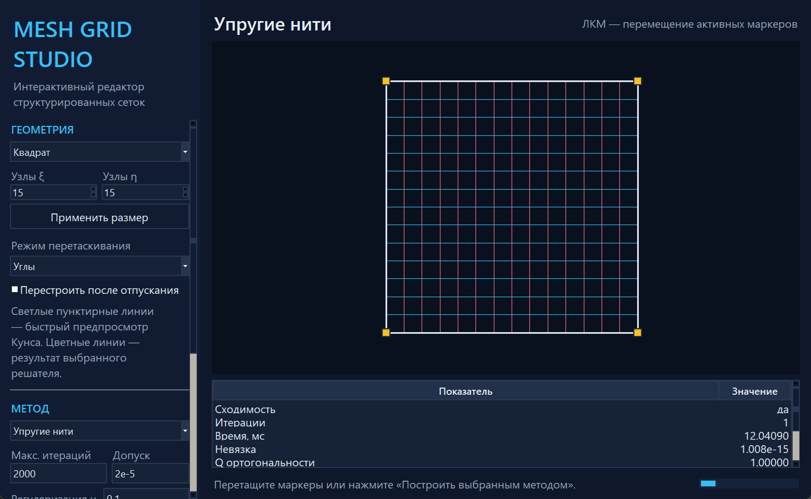
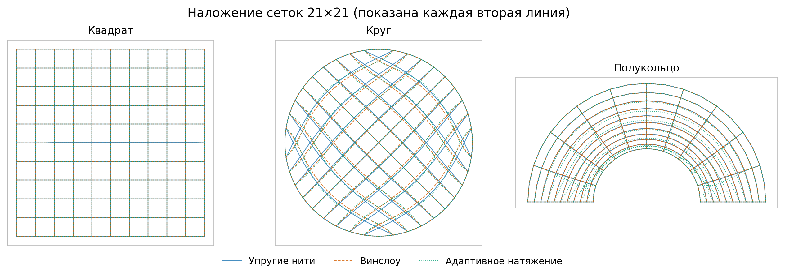

# Mesh Grid Studio

Интерактивная программа и воспроизводимое исследование трёх методов
построения двумерных структурированных расчётных сеток:

- метода упругих нитей;
- метода Винслоу;
- регуляризованного метода адаптивного натяжения.



Проект объединяет вычислительное ядро, редактор границы, автоматические
тесты и научную статью. В `article.tex` перенесена теоретическая часть
исходной работы, а прежние программные листинги заменены реализациями,
которые действительно соответствуют приведённым дискретным постановкам.
Исходная работа сохранена в `main.tex`, материалы В. Ф. Тишкина — в
`tishkin_grid.tex` и отдельной позиции списка литературы.

## Основной результат

Единственного лучшего метода для всех рассмотренных областей нет.

| Область | Практический вывод | Численное основание |
|---|---|---|
| Квадрат | Контрольный аффинный случай: методы эквивалентны | `Q_orth = 1`, `Jsc = 1`, `AR95 = 1` |
| Круг | Винслоу лучше при приоритете ортогональности | `Q_orth = 0.9368`, на 2.01% выше метода упругих нитей |
| Круг | Адаптивный метод лучше по равномерности площадей и отношению сторон | `CV_A = 0.0650`, `AR95 = 2.0006`; `CV_A` на 49.69% ниже Винслоу |
| Полукольцо | Сбалансированные упругие нити дают лучший совокупный результат | `Jsc = 0.9569`; балансировка устраняет 104 инвертированные ячейки равножёсткого варианта |
| Полукольцо | Адаптивный вариант при `mu = 0.1` неприемлем по форме ячеек | `Jsc` в 33.00 раза ниже, `AR95` в 14.18 раза выше упругих нитей |



Все опубликованные значения относятся к сеткам `21 × 21` с фиксированными
граничными узлами. Они характеризуют геометрию сеток, а не ошибку решения
последующего дифференциального уравнения.

## Статья

- [Собранная статья в PDF](output/pdf/article.pdf)
- [Исходный текст статьи](article.tex)
- [Аудит исходных алгоритмов](AUDIT.md)
- [Описание воспроизводимых материалов](SUPPLEMENTARY.md)

Статья содержит постановку задачи, теорию трёх методов, дискретизацию,
контроль аналитических градиентов, критерии качества, явное попарное
сравнение, наложение сеток, описание интерфейса, ограничения эксперимента
и выводы по выбору метода. Упоминания учебного заведения из неё удалены;
документ оформлен как самостоятельная научная статья.

## Возможности программы

- квадрат, круг, полукольцо и произвольно отредактированная область;
- выбор одного из трёх независимых решателей;
- перетаскивание углов, узлов границы, целых сторон и всей области;
- ручное перемещение внутренних узлов построенной сетки;
- быстрый предпросмотр Кунса и вычисление в фоновом потоке;
- контроль сходимости, ориентированного якобиана, инверсий,
  ортогональности, разброса площадей и отношения сторон;
- сохранение проекта в JSON;
- экспорт координат в CSV и изображения в PNG.

## Быстрый запуск

Требуется Python 3.11 или новее.

```powershell
python -m venv .venv
.\.venv\Scripts\Activate.ps1
python -m pip install -r requirements.txt
python mesh_gui.py
```

Готовая переносимая Windows-сборка публикуется в разделе
[Releases](https://github.com/jabrailkhalil/MeshGridStudio/releases).
Она запускается без установленного Python.

## Воспроизведение результатов

```powershell
python -m unittest -v test_mesh_methods.py test_mesh_gui.py
python mesh_methods.py --output-dir output/generated
python mesh_methods.py --adaptive-mu0-control --output-dir output/generated
pdflatex -interaction=nonstopmode -halt-on-error -output-directory=output/pdf article.tex
pdflatex -interaction=nonstopmode -halt-on-error -output-directory=output/pdf article.tex
```

Основной эксперимент создаёт CSV с метриками, таблицу LaTeX, PNG/PDF
рисунки и JSON с параметрами, версиями библиотек, историями оптимизации и
признаками сходимости. Контрольный запуск `mu = 0` выполняется отдельно и
занимает больше времени.

## Сборка Windows-приложения

```powershell
python -m pip install -r requirements-build.txt
powershell -ExecutionPolicy Bypass -File .\build_exe.ps1
```

Сборка создаётся в `output/app/MeshGridStudio/`. Проверка собранного
исполняемого файла:

```powershell
output/app/MeshGridStudio/MeshGridStudio.exe --solver-self-test
output/app/MeshGridStudio/MeshGridStudio.exe --smoke-test
```

## Структура проекта

```text
mesh_methods.py         вычислительное ядро, метрики и эксперимент
mesh_gui.py             интерфейс Tk и интерактивный редактор
mesh_gui_model.py       модель проекта и редактирования границы
test_mesh_methods.py    15 тестов численных методов
test_mesh_gui.py        10 тестов интерфейсной модели и диспетчеризации
article.tex             научная статья
main.tex                архивный исходный текст работы
tishkin_grid.tex        материалы В. Ф. Тишкина
output/generated/       численные результаты и рисунки
output/pdf/article.pdf  собранная статья
```
